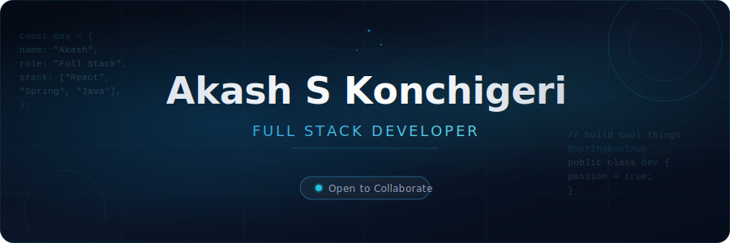

<!-- ═══════════════════════════════════════════════════════════════ -->
<!--           AKASH S KONCHIGERI — GitHub Profile README           -->
<!--        Premium Dark · Glassmorphism · Blue/Cyan Design          -->
<!-- ═══════════════════════════════════════════════════════════════ -->

<div align="center">

<!-- ── BANNER ──────────────────────────────────────────────────── -->


<br/>
<br/>

<!-- ── ANIMATED TYPING HEADER ──────────────────────────────────── -->
[](https://git.io/typing-svg)

<br/>

<!-- ── QUICK STATS ROW ──────────────────────────────────────────── -->
<p>
  
  &nbsp;&nbsp;
  <a href="https://github.com/Konchigeriakash?tab=followers">
    
  </a>
  &nbsp;&nbsp;
  
  &nbsp;&nbsp;
  
</p>

</div>

<br/>


<br/>

<!-- ══════════════════════════════════════════════════════════════ -->
<!--  ABOUT ME                                                       -->
<!-- ══════════════════════════════════════════════════════════════ -->

<div align="center">

## `{ About Me }`

</div>

<br/>

<table align="center" border="0" cellpadding="0" cellspacing="0">
<tr>
<td width="55%" valign="top">

```typescript
const akash = {
  name     : "Akash S Konchigeri",
  role     : "Full Stack Developer",
  location : "India 🇮🇳",

  stack: {
    languages : ["Java", "Python", "C", "C++", "R"],
    frontend  : ["React", "HTML", "CSS", "JavaScript"],
    backend   : ["Spring Boot", "Django"],
    databases : ["MongoDB", "MySQL", "Oracle SQL"],
    tools     : ["Git", "VS Code", "IntelliJ", "Postman"],
  },

  learning  : "Spring Boot ⚡",
  openTo    : ["Collaboration", "Open Source", "Projects"],
  philosophy: "Ship. Learn. Iterate.",
};
```

</td>
<td width="5%"></td>
<td width="40%" valign="top">

<br/>

🎯 &nbsp;**Currently** building full-stack applications with Java & Spring Boot

⚡ &nbsp;**Exploring** microservices architecture and RESTful API design

🌱 &nbsp;**Growing** into backend engineering with a production mindset

🔭 &nbsp;**Open to** collaborating on meaningful open-source projects

🛠️ &nbsp;**Projects** that blend real-world utility with clean code

📍 &nbsp;**Based in** India — building for the world

<br/>

> *"First, solve the problem. Then, write the code."*
> — John Johnson

</td>
</tr>
</table>

<br/>

<br/>

<!-- ══════════════════════════════════════════════════════════════ -->
<!--  TECH STACK                                                     -->
<!-- ══════════════════════════════════════════════════════════════ -->

<div align="center">

## `{ Tech Stack }`

</div>

<br/>

<div align="center">

**Languages**

<p>
  
  &nbsp;
  
  &nbsp;
  
  &nbsp;
  
  &nbsp;
  
</p>

<br/>

**Frontend**

<p>
  
  &nbsp;
  
  &nbsp;
  
  &nbsp;
  
</p>

<br/>

**Backend**

<p>
  
  &nbsp;
  
</p>

<br/>

**Databases**

<p>
  
  &nbsp;
  
  &nbsp;
  
</p>

<br/>

**Tools & Environment**

<p>
  
  &nbsp;
  
  &nbsp;
  
  &nbsp;
  
  &nbsp;
  
  &nbsp;
  
</p>

</div>

<br/>

<br/>

<!-- ══════════════════════════════════════════════════════════════ -->
<!--  FEATURED PROJECTS                                              -->
<!-- ══════════════════════════════════════════════════════════════ -->

<div align="center">

## `{ Featured Projects }`

</div>

<br/>

<div align="center">
<table border="0" cellpadding="10" cellspacing="10">
<tr>

<!-- PROJECT 1: AgriCalc-Scan -->
<td width="33%" valign="top">

<div align="center">

### 🌾 AgriCalc-Scan


&nbsp;

&nbsp;


</div>

An agricultural utility application that enables smart crop scanning and calculation. Combines computer vision principles with a clean web interface — designed to assist farmers and agricultural analysts with data-driven decision making.

<div align="center">

<br/>

[](https://github.com/Konchigeriakash/AgriCalc-Scan)

</div>

</td>

<td width="1%" align="center"></td>

<!-- PROJECT 2: JavaDBMSProject -->
<td width="33%" valign="top">

<div align="center">

### 🗄️ JavaDBMSProject


&nbsp;

&nbsp;


</div>

A full-featured Java-based Database Management System project. Implements core DBMS concepts — CRUD operations, relational data modelling, and SQL query optimisation — with a structured backend architecture using JDBC and Java Swing.

<div align="center">

<br/>

[](https://github.com/Konchigeriakash/JavaDBMSProject)

</div>

</td>

<td width="1%" align="center"></td>

<!-- PROJECT 3: Grade -->
<td width="33%" valign="top">

<div align="center">

### 📊 Grade


&nbsp;

&nbsp;


</div>

A grade management and analysis tool for tracking academic performance. Provides calculation, reporting, and visualisation features for student grades — built with a focus on clean logic and reliable data handling.

<div align="center">

<br/>

[](https://github.com/Konchigeriakash/Grade)

</div>

</td>

</tr>
</table>
</div>

<br/>

<br/>

<!-- ══════════════════════════════════════════════════════════════ -->
<!--  GITHUB STATS                                                   -->
<!-- ══════════════════════════════════════════════════════════════ -->

<div align="center">

## `{ GitHub Stats }`

</div>

<br/>

<div align="center">


&nbsp;&nbsp;


</div>

<br/>

<div align="center">


</div>

<br/>

<div align="center">


</div>

<br/>

<br/>

<!-- ══════════════════════════════════════════════════════════════ -->
<!--  SNAKE ANIMATION                                               -->
<!-- ══════════════════════════════════════════════════════════════ -->

<div align="center">

## `{ Contribution Snake }`

<br/>

<picture>
  <source media="(prefers-color-scheme: dark)" srcset="https://raw.githubusercontent.com/Konchigeriakash/Konchigeriakash/output/github-contribution-grid-snake-dark.svg">
  <source media="(prefers-color-scheme: light)" srcset="https://raw.githubusercontent.com/Konchigeriakash/Konchigeriakash/output/github-contribution-grid-snake.svg">
  
</picture>

</div>

<br/>

<br/>

<!-- ══════════════════════════════════════════════════════════════ -->
<!--  CODING PHILOSOPHY & CURRENT GOALS                             -->
<!-- ══════════════════════════════════════════════════════════════ -->

<div align="center">

## `{ Philosophy & Goals }`

</div>

<br/>

<table align="center" border="0" cellpadding="0" cellspacing="0" width="90%">
<tr>
<td width="48%" valign="top">

### 🧠 Coding Philosophy

```
  Clean > Clever
  Readable > Compact  
  Shipped > Perfect
  Iterative > Big Bang
  Document as you build
  Tests save future-you
```

I believe in writing code that solves real problems — not code that shows off. Every system should be as simple as it can be while doing everything it needs to do.

</td>
<td width="4%"></td>
<td width="48%" valign="top">

### 🎯 Current Goals

```
  ✦  Master Spring Boot microservices
  ✦  Build a production-grade full-stack app
  ✦  Contribute to open-source projects
  ✦  Strengthen system design fundamentals
  ✦  Explore cloud deployment (AWS / GCP)
  ✦  Write cleaner, tested backend APIs
```

Focused on going from "it works" to "it scales, it's tested, and it's maintainable."

</td>
</tr>
</table>

<br/>

<br/>

<!-- ══════════════════════════════════════════════════════════════ -->
<!--  CURRENTLY LEARNING                                            -->
<!-- ══════════════════════════════════════════════════════════════ -->

<div align="center">

## `{ Currently Learning }`

<br/>

<table border="0" cellpadding="12">
<tr>
<td align="center">
<br/>
<sub><b>Spring Boot</b></sub><br/>
<sub>REST APIs · Security · JPA</sub>
</td>
<td align="center">
<br/>
<sub><b>Docker</b></sub><br/>
<sub>Containers · Dev Environments</sub>
</td>
<td align="center">
<br/>
<sub><b>Cloud (AWS)</b></sub><br/>
<sub>EC2 · S3 · Deployments</sub>
</td>
<td align="center">
<br/>
<sub><b>Maven / Gradle</b></sub><br/>
<sub>Build Tools · Dependency Mgmt</sub>
</td>
</tr>
</table>

</div>

<br/>

<br/>

<!-- ══════════════════════════════════════════════════════════════ -->
<!--  FUN FACTS                                                     -->
<!-- ══════════════════════════════════════════════════════════════ -->

<div align="center">

## `{ Fun Facts }`

</div>

<br/>

<div align="center">
<table border="0" cellpadding="6">
<tr>
<td>⚡</td><td>I debug faster with a coffee in hand than without one</td>
</tr>
<tr>
<td>🌍</td><td>I believe the best projects solve real human problems</td>
</tr>
<tr>
<td>🧩</td><td>I enjoy understanding <i>why</i> things work, not just that they do</td>
</tr>
<tr>
<td>📖</td><td>I read code like others read books — for patterns and structure</td>
</tr>
<tr>
<td>🎯</td><td>My ideal stack: Java + Spring Boot + React + MongoDB</td>
</tr>
<tr>
<td>🔁</td><td>My workflow: build a thing → break it → fix it → understand it</td>
</tr>
</table>
</div>

<br/>

<br/>

<!-- ══════════════════════════════════════════════════════════════ -->
<!--  CONNECT                                                        -->
<!-- ══════════════════════════════════════════════════════════════ -->

<div align="center">

## `{ Let's Connect }`

<br/>

<p>
  <a href="https://github.com/Konchigeriakash" target="_blank">
    
  </a>
  &nbsp;
  <a href="https://www.linkedin.com/in/konchigeriakash" target="_blank">
    
  </a>
</p>

<br/>

*Have an idea, a project, or just want to say hi?*
*My GitHub DMs and LinkedIn are always open.*

</div>

<br/>

<br/>

<!-- ══════════════════════════════════════════════════════════════ -->
<!--  FOOTER                                                         -->
<!-- ══════════════════════════════════════════════════════════════ -->

<div align="center">

<sub>
Designed & built by <a href="https://github.com/Konchigeriakash"><b>Akash S Konchigeri</b></a> &nbsp;·&nbsp; Updated 2025
</sub>

<br/><br/>

<sub>⭐ If you found any of my projects useful, a star goes a long way.</sub>

</div>

<br/>
